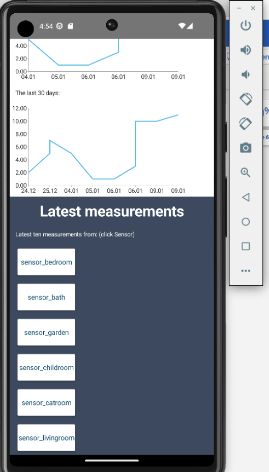

# Wetterstation-Mobile-App
Jasmin Feichtinger und Martin Pressl
## Technische Beschreibung
Es handelt sich um eine NativeScript App, die mit Angular erstellt wurde. NativeScript ist ein Open-Source-Framework, das für die Entwicklung von Apps auf iOS und Android eingesetzt wird. Als Programmiersprachen werden JavaScript und TypeScript eingesetzt. Wenn man NativeScript verwendet, wird nicht mit HTML gearbeitet, sondern mit XML. Angular ist ein Front-End-Webapplikationsframework, welches mit einer Sammlung von integrierten Bibliotheken eine Vielzahl von Funktionen abdeckt.
Als Mobile Phone haben wir uns für Android Studio entschieden. Hierbei handelt es sich um eine Entwicklungsumgebung von Google die für die Entwicklung von Android Software gedacht ist.
Die App erhält die Daten von unserem erstellten Backend. Hierbei greift das Frontend auf die API-Schnittstelle über den Port 8082 zu. Wir haben folgendes Backend verwendet:

## Pitfalls
Durch dieses Projekt wurde einem bewusst, was für ein Vorteil eine große Community mit sich bringt! NativeScript hat eine kleine Community, und dadurch war es sehr schwer etwas zu googeln und eine sinnvolle Antwort zu finden. Auch die Dokumentation auf https://nativescript.org ist mangelhaft, und gibt mehr Fragen als Antworten zurück. Durch die mangelhafte Dokumentation war es sehr kompliziert die Entwicklungsumgebung einzurichten.
Die ersten Überraschungen entstanden durch die Zusammenlegung von Backend und Frontend. Hier mussten noch einige Änderungen im Backend vorgenommen werden, damit überhaupt eine Kommunikation stattfinden konnte. Auch die Verwendung des Codes, den wir mit Frau Schabasser entworfen haben, erwies sich als Problem. Zum einem wird bei NativeScript nicht HTML sondern XML verwendet. Dadurch mussten wir den Code umschreiben und eine neue Sprache lernen. Zum andern passte das Fake-Backend nicht mit dem tatsächlichen Backend überein. Daher mussten wir auch hier wieder den Code anpassen.
Da unser Team aus zwei Personen besteht, die kein IT-Wissen mitbringen, mussten wir viel Zeit in das Projekt investieren. Durch Try and Error und viel googeln entstand schlussendlich doch ein Projekt.

## Quellenverzeichnis
 - https://v7.docs.nativescript.org/angular/start/introduction [November 2022]
 - https://stackoverflow.com/questions/39832980/how-to-change-application-name-in-nativescript [November 2022]
 - https://www.youtube.com/watch?v=DcCSq2Y9bow&t=5954s [November 2022]
 - https://www.udemy.com/course/nativescript-angular-build-native-ios-android-web-app [November 2022]

## Screenshots

